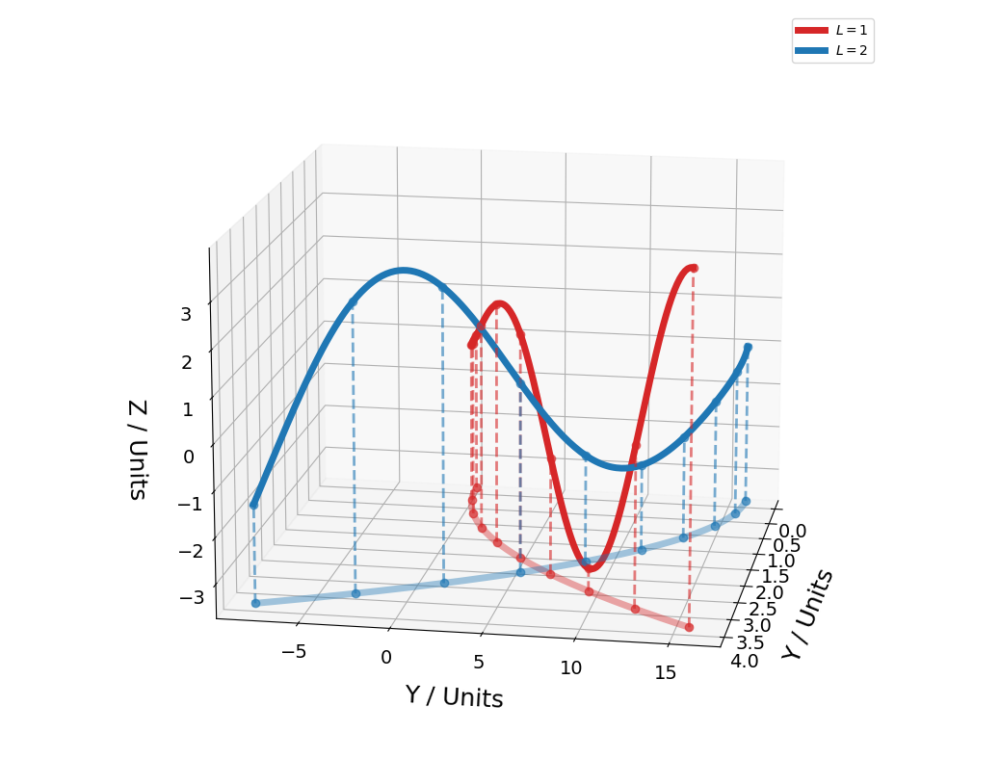

# 3D Projector

Code snippet to help make 3D plots of curves in matplotlib, adding in projections of those curves onto the XY-plane.
Without projections, the 2-dimensional view of a curve on a screen can sometimes be misleading or unclear. Adding in projections can make the paths of the curves less ambiguous.

## Acknowledgement
Inspired by [this tweet](https://twitter.com/BrainInTheMind/status/1517543839833243649) by Sanjay Manohar.

## Example
Using the attached script, you can select the number of vertical lines to add in to link the data points to their projections on the XY-plane.

